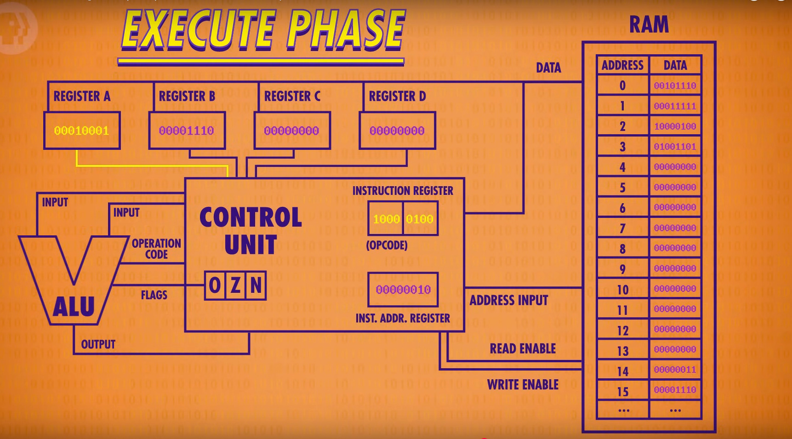

# Description
- All of this is a summary from : [cpuLinkVideo](https://www.youtube.com/watch?v=FZGugFqdr60)

- Alu -> calculations
- Register -> store values
- heart of pcs -> cpu
- cpu -> execute programs
- keep in mind something, when reading instructions
  those instructions will have an opcode, normally
  first mostsignificant bits
  this is important to keep in mind because at the moment

  of reading from the ram, this instruction needs to be 
  decoded == translated, in such a way that the alu know 
  what operation will need to do, so the control unit is the one
  that will take care of getting the instruction and analysing the 
  opcode and like that informing the alu what to do.
- Parts of the cpu
  - registers
  - instruction address register
  - instruction register 
- cpu process
  - First the cpu **fetch** the instruction pointed in the instruction address
    register from the ram and stored in the .
  - Once the the instruction is saved in the instruction register, The second 
    phase start, that is the decoded phase, in this case the opcode of the 
    instruction is read or interpreted by a control unit 
    (made out of logic gates) - Once, the decoded process is done, 
  - the instruction to be done is passed to the ALU.
  - The control unit is in charge to pass the correct inputs and tell the
    alu what operation it should do via the operation opcode .
  - Here is the process better described with an image
  

