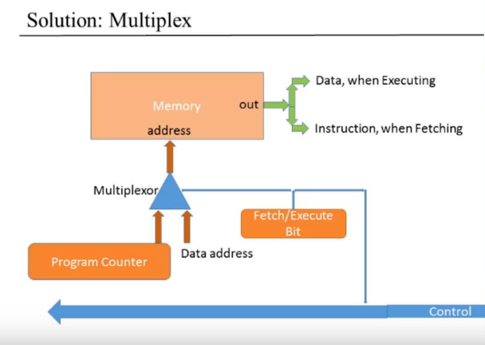
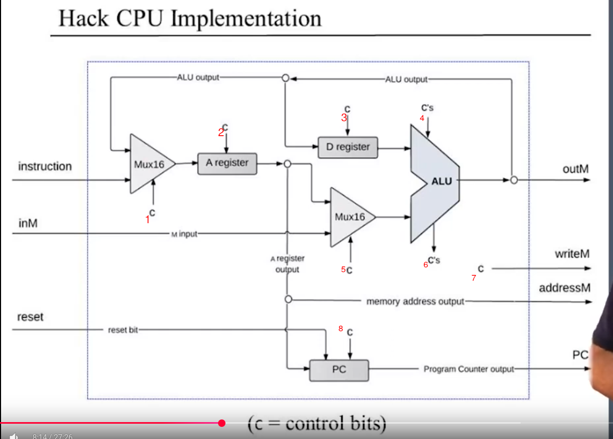
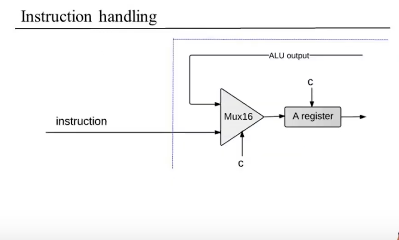
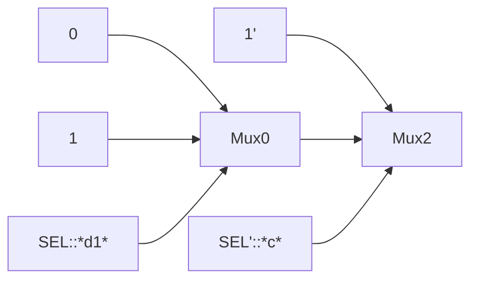

# Description

This are the notes for the course nand2tetris, idea is understanding how computer
works

here is an overall image of the course

[!overall course](./img/nand2tetrisOverall.png)

# week_1

computers -> 0 and 1
how to deals with 0 and 1
0 == f == N
1 == T == Y

what can we do with 0 and 1
boolean operations
AND
OR
NOT
Boolean expressions
composition of boolean expresions
boolean functions
is boolean expresion with parameters

Any boolean function can be represented using nand operations

is demonstrated from a truth table that taking the 1 values of the rows
it will be a comb of (x and y) or (z and t) ......

So we need to demonstrate that nand can be either and, not and or

so we know that

(x or y) == not(x) and not(y)
== (x nand x) and (y nand y)
==

so now we know that or can be expressed with not and "and" operations

and then keeping in mind that nand == not(x and y)
so if and is

---AND---

x|y|r
0|0|0
0|1|0
1|0|0
1|1|1

---NAND---
x|y|r
0|0|1
0|1|1
1|0|1
1|1|0

so now

NOT(x) == (x nand x)

and now that we know that or could be represented and not could be represented as well we can demonstrate
and

(x AND y) == NOT(x NAND y)

(x AND y) == (x NAND y) NAND (x NAND y)

for demonstrating it a table can be done

+---+---+-----------------+----------+---------+
| x | y | (x nand y) as t | t nand t | x and y |
+---+---+-----------------+----------+---------+
| 0 | 0 | 1 | 0 | 0 |
+---+---+-----------------+----------+---------+
| 0 | 1 | 1 | 0 | 0 |
+---+---+-----------------+----------+---------+
| 1 | 0 | 1 | 0 | 0 |
+---+---+-----------------+----------+---------+
| 1 | 1 | 0 | 1 | 1 |
+---+---+-----------------+----------+---------+

perfect just with nand everything can be done -- boolean logic

---

Before this boolean functions, now encapsulating this in chips will be the next step

Logic gates ->
-> stand alone chip that give a functionalitie
-> interface answers the question what

HDL hardware description languague

interface == unique
implementatin => varies

Why do we need Or8way gate????

I forgot i had mux16 but i want to uderstand why nested mux can give the result of a mux16 how the bits are added check that?
the bits are added because in the out we place bit by bit using out[x]
for example a[0] and b[0] if we want to keep a we do sel 0 and will take that bit of a an put it in out[0]
end ----- Project 1 ------

## Project 2

### ALU

Von neumman computer architecture
[!Computer architecture](./img/VonNeumannArch.png)

Writting alu

### Project 3

## Sequential logic

- Before doing combinational logic

  - The meaning of time was not existant

- We need time

  - Same hardware for compute the same thing (resuse hardware).
  - **Remember things** for the pass (intermediate result ).
  - Deal with speed.

- Convert continous physical time to descript time
- Good image explaining this

  - [!image the clock](./img/theclock.png)

- The delays are considered and handled by the clock frequence

- So before combinatorial logic -> out[t] = function(in[t])
- Now is sequential logic -> state[t] = function(in[t-1])
- So basically sequential depend on present inputs + past outputs (a counter is a good example) ==> Flip Flops (Needs a memory)

## Flip Flops

- This will create the missing part to keep the previous output

## How everything will be design from now

- Basically for building the future gates, for different functionalities
- This will be the settup
- [! sequential logic implementtion](./img/sequentialLogic.png)

## Memory units

- Memory

  - Main memory RAM
  - Secondary memory: disk,..
  - Volatile/non-volatile???

- Ram

  - Data (of a program)
  - Instructions (of a program)

- Perspectives
  - Physical
  - **Logical**
- logical considerations
- Ram unit
- Before RAM there is register
- Register

  - load + mutex + d flip-flop == register

- A register image:
  - [!1 bit register image](./img/dflipflop1bitregister.png)

## Machine languague (week4)

- What we can do with the computer.
- Computers can do many things.
- Von Neuman, we can put the software in the hardware.
- We are going to handle machine languaue, modern programming languagues
- Takes the code and the compiler translate it to machine languague
- Machine languagues (sequences of bits ==> 110010101...)
- Is good to use Mnemonics -> assembly languaue
- So basically what happens is that we are going to use a tool (an assembler ) that
  will do a translation of nmenonics that makes easier
  to code in machine languague, then this tool

- Will translate this to bits 0 or 1s.
- Machine languague is one if not the most importance interface, due to its give
  us the possibility to interact between software and hardware.

- Memory hierarchy
  - Accessing memory location is costly
  - From quicker to longer, from shorter to bigger
  - cpu => registers -> cache -> main memory -> disk
  - Registers smallest memory unit
  - CPU usually contain a few easily accessed "registers".
  - Data registers
    - Add R1,R2
  - Address registers
    - Store R1,@A
  - Addressing modes
    - Register
      - Add R1, R2 -> R2=R2+R1
    - Direct
      - Add R1,M[200] -> Mem[200] = Mem[200] + R1
    - Indirect
      - Add R1,@A -> Mem[A] = Mem[A] + R1
    - Immediate
      - Add 73, R1 -> R1=R1+73
  - Flow control
    - Usually CPU executes instructions in sequence
    - Sometimes we need to jump unconditionally
    - Jump for simulating loops (We can use labels taking advantage of assebly)
    - Jump with condition can simulte if else

- # The hack machine languague

  - Hardware design and machine languague design goes by hand.
  - Hack computer -> instruction memory -> CPU -> data memory.
  - Data memory -> RAM -> sequence of 16 bit registers
  - Instruction memory -> separtae memory space -> (ROM) sequence of 16 bits registers.
  - CPU -> is able to perform instructions thanks to ALU
  - Instruction bus/ data bus/address buses -> moves the data through RAM = CPU = ROM
  - How we control this computer -> with software -> Machine languague.
  - Hack machine language
    - 16 bit A- instructions
    - 16 bit C- instructions
  - Hack program is a sequence of instructions written in the hack machine languague.
  - The computer has a reset button.

  - # Control

    - The ROM (instruction memory) is loaded with a Hack program. (how the program is loaded into the ROM?)
    - the reset button is pushed
    - the program starts running
  - The hack computer has

    - CPU -> A register -> holds 16 bit value (data value or address)
      -> D register -> holds 16 bit value
      RAM -> M register -> M represents the 16 bit RAM register addresed by A

  - The A instruction
    - Syntax @value
    - Semantics
      - Sets the A register to value
      - **Side effect: RAM[A] becomes the selected RAM register.**
    - example
      - @21
        -> the A register is setted to 21
      - the RAM[21] becomes the selected RAM register
      - // Set RAM[100] to -1
        @100 // 1 = 100
        Register a = 100
        RAM[100] is in M
        m = -1
  - The C instruction
    - dest = comp; jump (both dest and jump are optional)
    - store or jump
    - comp: -> 0, 1, -1, D, A ............
    - dest = null, M, D, MD, A AM, AD, AMD -> more than one is storing simultaneously. -> M -> refers to RAM[A]
    - jump: null, JGT, JEQ, JGE, JLT, JNE, JLE, JMP -> if (comp jump 0) jump to execute the instruction in ROM[A] -> those 8 possible conditions , they always compare the result of the computation to zero.
    - If the boolean expression (comp jump 0) is true, jumps to execute the instruction stored in ROM[A].

    - # Example

      - // if (D-1==0) jump to execute the instruction stored in ROM[56]

- # Pointers

  -

# Chapter 5

## Von Neumann Architecture

-

- One computer can run any kind of program --> (universal turing machine)
- How can be done the computer
- Computer system
  - Input
  - Memory
    - program memory => will contain the series of instruction
      that will be executed one by one.
    - data memory
  - Cpu
    - ALU
      - data bus
        - Accept numbers
        - send numbers
      - control bus
        - get what kind of op need to do.
        - Tell the other parts of the system what to do.
    - Registers
      - data bus
        - Take data
      - address bus
        - because the registers will store sometimes addresses
  - Output
- information flows (buses || wires)
  - Data
  - Address
  - Data
  - Something that I get is that the memory need to be connected
    to the control bus because when a instruction is fetched,
    the control unit accessible through the control bus will need
    to decode the instruction and then tell the alu what to do
    so we can think the control unit as intermediary between the
    program memory and the alu.

## The CPU process

- the cpu follows a basic loop (fetch, decode, execute)
- In this image What I could understood is the following
  as the memory component has the data and the program
  memory, it will cause a crash at the moment of
  excecuting and fetching. So when the alu will be
  fetching(taking the instruction
  (This also is passed by the unit)) this will set
  a flag that disable data address for getting a value
  otherwise, the address passed to the memory will be
  the one for getting the value stored in the data
  address.



## The fetch execute cycle

- Basically in this step is explained how the cpu
  will fetch instructions from the program memory.
  And how it executes it.

- So far we know that the program memory will have to
  receive an input that is the address of the instruction
  that wants to be outputted, so what needs to be done
  is having a temporal register (pc) that will keep the
  address of the next instruction, this will be passed
  as input of the program memory and in that way the program
  memory will be able to locate that actual instruction and
  outputted. (**THIS IS THE FETCH PART**)

- So, then the fetch is done, the ouput instruction gotten,
  is handled by the control unit, this one will understand the
  instruction by checking its opcode, and then telling to the
  ALU what operations need to perform, besides this unit
  handle the coordination of the other components

- The hack computer architecture

## Project 5

- So for doing this project we need to organice
  our thoughts, so first
  - What do we have to do?
    - build
      - CPU [0]
      - MEMORY [1]
      - ROM --> (already provided) [2]
      - COMPUTER == CPU + MEMORY + ROM [4]

- So that is the order that I will take for
  build each component.

### [0]

- Execute the current instruction
- Figure out which instruction to execute next

- So what do we need for building the cpu

- First look the interface that we need to
  implement, for knowing what we receive and
  what we send
  - inputs:
    - instruction --> (Comming from the ROM)
    - inM --> (input comming from the data memory)
    - reset ==> (input comming from external user that activates the cpu)

  - outputs
    - outM --> (value outputted from the ALU, and given to the data memory)
    - writeM --> (value outputted for enabling writing in register in addressM of the data memory)
    - addressM --> (value outputted that tell exactly what register to modify in the data memory)
    - PC --> (value that has the address of the register that has the next instruction in the ROM)

- CPU
    - ALU --> already gotten
    - Registers --> already gotten
    - Control unit --> not yet

- Control unit
    - this unit will handle and coordinate the different process
    - This units take the instruction and check the opcode, and depending it,
      it will increment in different ways the PC, tell the ALU what to do

- I am taking notes in paper I will suddenly pass it to here as an image.
- 

# Building cpu steps

## First part
In this part I will handle.

- for the first C I need to take the opcode **(in[0])** of the incoming
  instruction, in such a way I know if i am taking an A
  instruction a save it's value in the register or the 
  C instruction.

- For the second C, I need to do multiple considerations, that can 
  be better explained in the way of a if else condition statement
  ```python
  if c==0:
    load=1
  else:
    if d1==1:
      load=1
    else:
      load=0
  ```
  This can be translated to logic gates in the 
  following manner.


